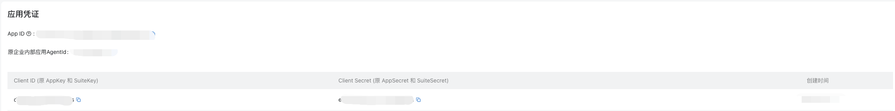

# 钉钉机器人创建流程指南

> 本文档基于钉钉官方文档整理，详细说明如何创建钉钉机器人（AI 助理员工）。

---

## 前提条件

在开始创建机器人之前，请确保：

1. **拥有开发者权限**：选择您有开发者权限的组织，或先获取开发者权限
2. **已登录开发者后台**：访问 [https://open-dev.dingtalk.com](https://open-dev.dingtalk.com)

---

## 步骤一：一键创建  机器人

### 1.1 登录开发者后台

访问钉钉开发者后台：[https://open-dev.dingtalk.com](https://open-dev.dingtalk.com)

> 注意：需要使用钉钉账号登录，并确保拥有相应组织的开发者权限。

### 1.2 进入应用开发页面

在开发者后台首页，找到 **「应用开发」** 模块，点击 **「立即创建」** 按钮。

### 1.3 创建  机器人

在创建  界面，填写机器人基本信息：

| 字段 | 说明 | 是否必填 |
|------|------|----------|
| 机器人名称 | 您的机器人名称 | 是 |
| 机器人简介 | 简要描述机器人功能 | 是 |
| 机器人图标 | 上传机器人头像 | 否（可使用默认图标） |

**提示**：您也可以直接使用默认的机器人信息，点击 **「确定」** 即可快速创建。

### 1.4 保存 Client ID 和 Client Secret

创建成功后，系统会自动展示应用的 **Client ID** 和 **Client Secret**。

> ⚠️ **重要提示**：
> - Client ID 和 Client Secret 是应用的关键信息，也是操作应用数据的核心参数
> - 请妥善保管，切勿轻易提供给他人使用
> - 建议立即保存这两项信息到安全位置

### 1.5 自动开通的权限

创建  机器人后，系统会自动开通以下权限，无需手动申请：

| 权限代码 | 说明 |
|----------|------|
| `Card.Streaming.Write` | 卡片流式写入权限 |
| `Card.Instance.Write` | 卡片实例写入权限 |
| `qyapi_robot_sendmsg` | 机器人消息发送权限 |

### 1.6 查看凭证信息

创建成功后，您可以在应用的 **「凭证与基础信息」** 页面中，随时查看应用的 Client ID 和 Client Secret。

---

## 完整流程概览

创建  机器人的完整流程包括以下步骤：

| 步骤 | 名称 | 说明 |
|------|------|------|
| 步骤一 | 一键创建机器人 | 在开发者后台创建机器人应用 |
| 步骤二 | 部署  | 选择部署方式（ECS/轻量服务器/本地） |
| 步骤三 | 使用钉钉机器人 | 在单聊或群聊中使用机器人 |

---
